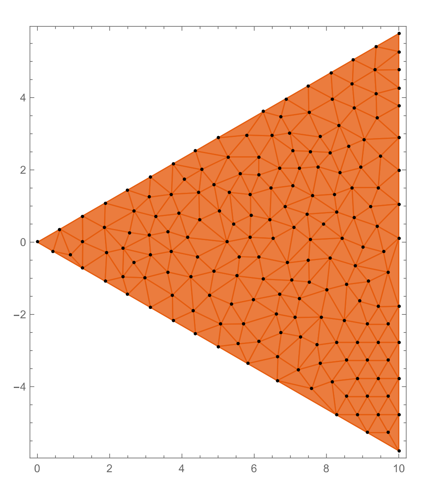
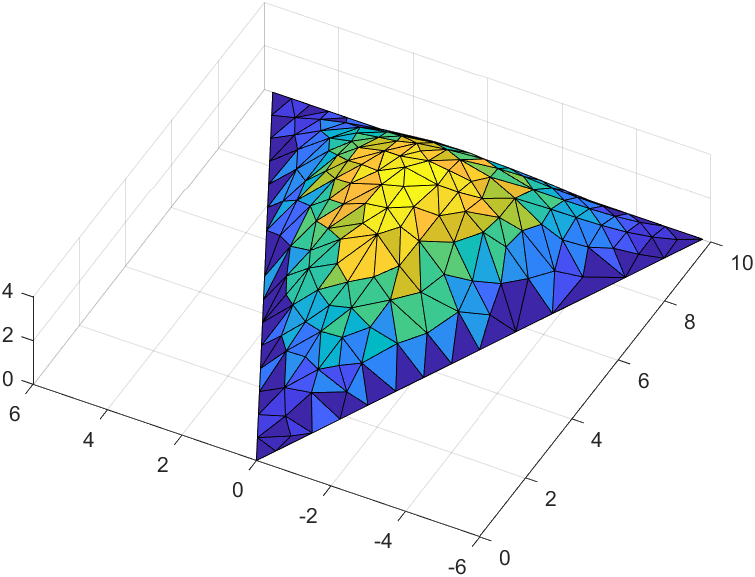
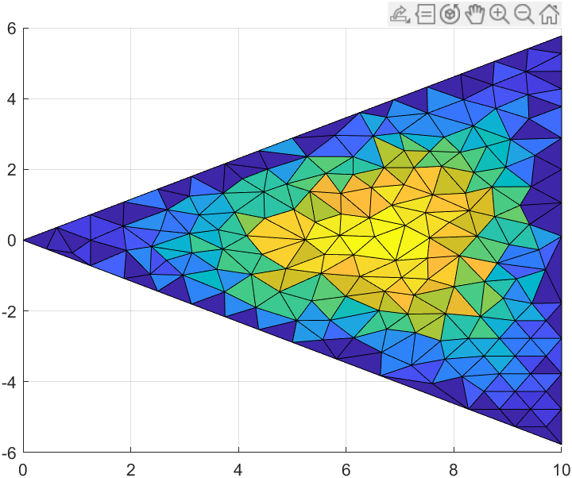
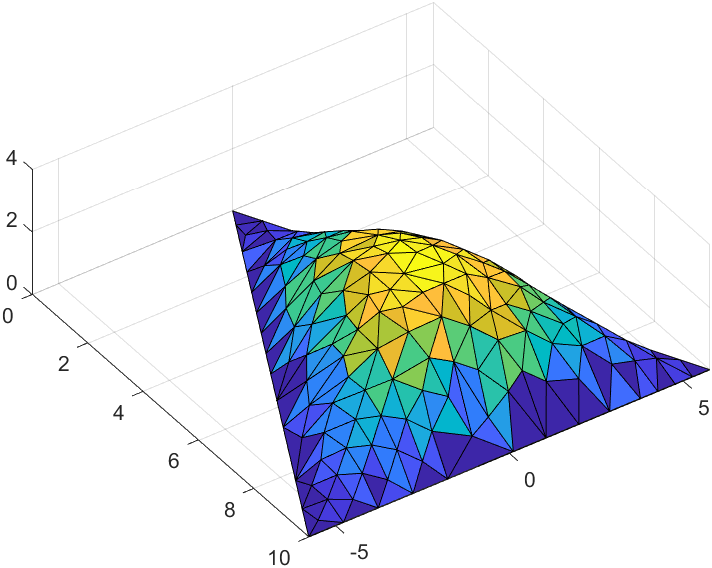
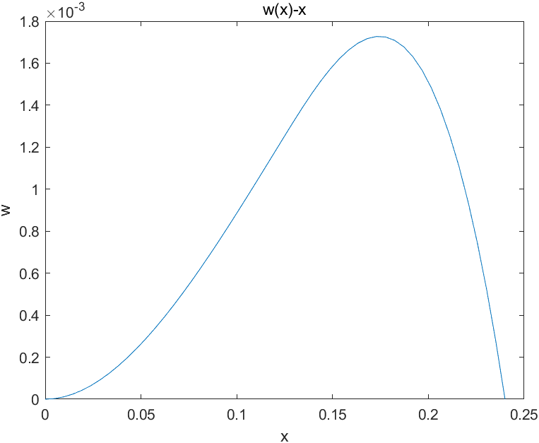
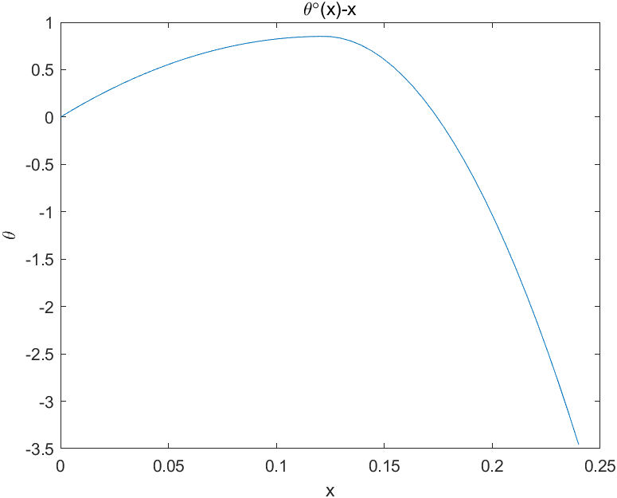

# problem

## problem 1

1. Write the equivalent governing equation in the domain

the equivalent governing equation is:
$$
-\Delta u = 1
$$

2. Programming

get the mesh from triangulation mesh generator:

<center>

</center>

use matlab to solve problem 1

read mesh information and set b as 10:

```matlab
clear;clc;close all;

NE = textread('mesh.txt', '%d', 2);
N = NE(1);
E = NE(2);
data = readmatrix('mesh.txt');
position = data(1:N, 1:2);
connect = round(data(N+1:N+E, 2:4)) + 1;
b = 10;
alpha = 30*pi/180;
```

the position of node to solve is as below:

```matlab
NI = [];
toler = 1e-5;
for i = 1: N
    x = position(i, 1);
    y = position(i, 2);
    a1 = abs(x - b);
    a2 = abs(y - tan(alpha) * x);
    a3 = abs(y + tan(alpha) * x);
    if a1 > toler && a2 > toler && a3 > toler
        NI = [NI, i];
    end
end
```

the core codes of FEM:

```matlab
K = zeros(N, N);
F = zeros(1, N);
u = zeros(1, N);
for k = 1: E
    node1 = connect(k, 1);
    node2 = connect(k, 2);
    node3 = connect(k, 3);
    x1 = position(node1, 1);
    y1 = position(node1, 2);
    x2 = position(node2, 1);
    y2 = position(node2, 2);
    x3 = position(node3, 1);
    y3 = position(node3, 2);
    A2 = 2*det([1 x1 y1; 1 x2 y2; 1 x3 y3]);
    k11 = (x2 - x3)^2 + (y2 - y3)^2;
    k12 = (x1 - x3) * (-x2 + x3) + (y1 - y3) * (-y2 + y3);
    k13 = (x1 - x2) * (x2 - x3) + (y1 - y2) * (y2 - y3);
    k22 = (x1 - x3)^2 + (y1 - y3)^2;
    k23 = -(x1^2 + x2 * x3 - x1 * (x2 + x3) + (y1 - y2) * (y1 - y3));
    k33 = (x1 - x2)^2 + (y1 - y2)^2;
    F1 = (x3 * (y1 - y2) + x1 * (y2 - y3) + x2 * (-y1 + y3)) / 6;
    F2 = (x3 * (y1 - y2) + x1 * (y2 - y3) + x2 * (-y1+y3)) / 6;
    F3 = (x3 * (y1 - y2) + x1 * (y2 - y3) + x2 * (-y1+y3)) / 6;
    K(node1, node1) = K(node1, node1) + k11 / A2;
    K(node1, node2) = K(node1, node2) + k12 / A2;
    K(node1, node3) = K(node1, node3) + k13 / A2;
    K(node2, node1) = K(node2, node1) + k12 / A2;
    K(node2, node2) = K(node2, node2) + k22 / A2;
    K(node2, node3) = K(node2, node3) + k23 / A2;
    K(node3, node1) = K(node3, node1) + k13 / A2;
    K(node3, node2) = K(node3, node2) + k23 / A2;
    K(node3, node3) = K(node3, node3) + k33 / A2;
    F(node1) = F(node1) + F1;
    F(node2) = F(node2) + F2;
    F(node3) = F(node3) + F3;
end
```

solve by inverse of matrix and draw the 3D result:

```matlab
u(NI) = K(NI, NI) \ F(NI).';
trisurf(connect, position(:, 1), position(:, 2), u)

view([-62.63 75.27])
exportgraphics(gca, 'res1.png')
view([-0.44 90.00])
exportgraphics(gca, 'res2.png')
view([55.41 66.95])
exportgraphics(gca, 'res3.png')
```

the 3 views of $u$：

<center>

</center>

<center>

</center>

<center>

</center>


## problem 2

Lagrange equation:

$$
\frac{d}{dt}\frac{\partial L}{\partial \dot{q}_i}-
\frac{\partial L}{\partial q_i}=0
$$

for this system, we have

$$
\begin{cases}
    \begin{aligned}
        q_1 &= \theta_1\\
        q_2 &= \theta_2
    \end{aligned}
\end{cases}
$$

the velocity:

$$
\vec{V}_1=
    (l_1 \dot{\theta}_1 \cos \theta_1 + \dot{f})\vec{i}
    +
    l_1 \dot{\theta}_1 \sin\theta_1 \vec{j}
$$

$$
\vec{V}_2=
    (l_1 \dot{\theta}_1 \cos \theta_1 + l_2 \dot{\theta}_2 \cos \theta_2 + \dot{f})\vec{i}
    +
    (l_1 \dot{\theta}_1 \sin\theta_1 + l_2 \dot{\theta}_2 \sin\theta_2)\vec{j}
$$

thus we have kietic energy of the system:
$$
\begin{aligned}
    T&=\frac{1}{2}m_1 \vec{V}_1\cdot\vec{V}_1 + \frac{1}{2}m_2 \vec{V}_2\cdot\vec{V}_2\\
\end{aligned}
$$

and the potential energy is:

$$
V = m_1 g l_1 (1-\cos\theta_1) + m_2 g [l_1(1-\cos\theta_1) + l_2(1-\cos\theta_2)] 
$$

thus we will have:

$$
\begin{cases}
        \begin{aligned}
            &
            (m_1+m_2)(\ddot{f}\cos\theta_1 + g\sin\theta_1 + l_1 \ddot{\theta}_1)
            +
            l_2m_2\dot{\theta}_2^2 \sin(\theta_1-\theta_2)
            +
            l_2 m_2 \ddot{\theta}_2
            \cos(\theta_1 - \theta_2)=0\\
            &
            \ddot{f}\cos\theta_2
            +
            g\sin\theta_2
            -
            l_1 \dot{\theta}_1^2 \sin(\theta_1 - \theta_2)
            +
            l_1 \ddot{\theta}\cos(\theta_1 - \theta_2)
            +
            l_2\ddot{\theta}_2 = 0
        \end{aligned}
    \end{cases}
$$

## problem 3

governing equation:

$$
\frac{d^4 w}{dx^4} = \frac{q}{EJ}
$$

local stiffness relationship:

$$
EJ
    \begin{bmatrix}
        \frac{12}{h^3} & \frac{6}{h^2} & -\frac{12}{h^3} & \frac{6}{h^2} \\
        \frac{6}{h^2} & \frac{4}{h} & -\frac{6}{h^2} & \frac{2}{h} \\
        -\frac{12}{h^3} & -\frac{6}{h^2} & \frac{12}{h^3} & -\frac{6}{h^2} \\
        \frac{6}{h^2} & \frac{2}{h} & -\frac{6}{h^2} & \frac{4}{h} \\
       \end{bmatrix}
       \begin{bmatrix}
           w_k\\ \theta_k\\ w_{k+1}\\ \theta_{k+1}
       \end{bmatrix}
       =
       q
       \begin{bmatrix}
        \frac{h}{2}\\
        \frac{h^2}{12}\\
        \frac{h}{2}\\
        -\frac{h^2}{12}
        \end{bmatrix}+
        \begin{bmatrix}
            F_k\\
            -M_k\\
            F_{k+1}\\
            -M_{k+1}
        \end{bmatrix}
$$

the matlab code and result are as below:

set the calculation parameters

```matlab
clear;clc;close all;

q_ = -200;
F_ = -1000;
M_ = 2000;
L = 0.12;
d1 = 0.03;
d2 = 0.02;
Es = 200e9;
I1 = pi * d1^4 / 64;
I2 = pi * d2^4 / 64;
N = 51;
x = linspace(0, 2*L, N);
h = x(2) - x(1);
```

get the stiffness matrix (core code):

```matlab
K = zeros(2*N, 2*N);
b = zeros(2*N);
localk = [12/h^3, 6/h^2, -12/h^3, 6/h^2;
   6/h^2, 4/h, -6/h^2, 2/h;
   -12/h^3, -6/h^2, 12/h^3, -6/h^2;
   6/h^2, 2/h, -6/h^2, 4/h];
localb = h * [1/2, h/12, 1/2, -h/12];
not_boundary = [3:2*N-2, 2*N];

for k = 1:N-1
    if k <= (N-1)/2
        K(2*k-1:2*k+2, 2*k-1:2*k+2) = K(2*k-1:2*k+2, 2*k-1:2*k+2) + Es * I1 * localk;
        b(2*k-1:2*k+2) = b(2*k-1:2*k+2) + q_ * localb;
    else
        K(2*k-1:2*k+2, 2*k-1:2*k+2) = K(2*k-1:2*k+2, 2*k-1:2*k+2) + Es * I2 * localk;
    end
end
b(N) = b(N) + F_;
b(2*N) = b(2*N) - M_;
```

solve:

```matlab
bm = b(not_boundary);
Km = K(not_boundary, not_boundary);
solution = zeros(2*N);
solution(not_boundary) = Km \ bm.';
w = solution(1:2:2*N);
theta = solution(2:2:2*N);
```

draw the deflection picture:

```matlab
plot(x, w)
xlabel('x')
ylabel('w')
title('w(x)-x')
exportgraphics(gca, 'w.png')
hold off;
```

draw the torsion angle deflection:

```matlab
plot(x, theta*180/pi)
xlabel('x')
ylabel('\theta')
title('\theta\circ(x)-x')
exportgraphics(gca, 'theta.png')
```

the solution result is as below, where the deflection of the beam is:

<center>

</center>

the torsion angle is:

<center>

</center>