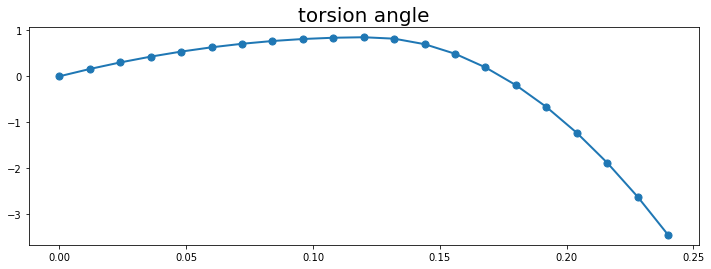

# homework

## homework 1

1. Write the equivalent governing equation in the domain

use integrate by part we will have:
$$
Ju=
\int_{\Omega} u(-\Delta u - 2)d\Omega
$$

thus the equivalent governing equation is:
$$
-\Delta u = 1
$$

2. Programming

use python to finish the job. The triangle mesh has 963 nodes and 1828 elements shown as below:

<center>

</center>

here is the description of code:

import the package:

```python
import numpy as np
import matplotlib.pyplot as plt
import matplotlib.tri as tri
```

read information of the mesh:

```python
mesh = "mesh.txt"
file = open(mesh, 'r')
tmp = file.readlines()
node_num = int(tmp[0])
elem_num = int(tmp[1])
file.close()
xy = np.loadtxt(mesh, dtype=float, skiprows=2, max_rows=node_num)[:, 0:2]
elem = np.loadtxt(mesh, dtype=int, skiprows=2+node_num, max_rows=elem_num)[:, 1:4]
triangle = tri.Triangulation(xy.T[0], xy.T[1], elem)
del tmp
```

draw the picture of mesh:

```python
plt.figure(figsize=(10, 10), facecolor="white")
plt.gca().set_aspect(1)
plt.triplot(triangle)
plt.savefig("mesh.png", bbox_inches="tight")
plt.show()
```

mark the nodes inside the domain:

```python
b = 1.0
line = np.sqrt(3) / 3
error = 1e-4
not_boundary_ID = []
for k in range(len(xy)):
    x, y = xy[k]
    error1 = np.abs(x-b)
    error2 = np.abs(y - line * x)
    error3 = np.abs(y + line * x)
    if error1 > error and error2 > error and error3 > error:
        not_boundary_ID.append(k)
        pass
    pass
not_boundary_ID = np.array(not_boundary_ID)
```

to get the $K$ and $b$ by finite element method:

```python
K = np.zeros([node_num, node_num])
B = np.zeros(elem_num)
for k in range(elem_num):
    ID1, ID2, ID3 = elem[k]
    x1, y1 = xy[ID1]
    x2, y2 = xy[ID2]
    x3, y3 = xy[ID3]
    A = 2 * np.linalg.det([
        [1, x1, y1],
        [1, x2, y2],
        [1, x3, y3]
    ])
    k11 = (x2 - x3)**2 + (y2 - y3)**2
    k12 = (x1 - x3) * (-x2 + x3) + (y1 - y3) * (-y2 + y3)
    k13 = (x1 - x2) * (x2 - x3) + (y1 - y2) * (y2 - y3)
    k22 = (x1 - x3)**2 + (y1 - y3)**2
    k23 = -(x1**2 + x2 * x3 - x1 * (x2 + x3) + (y1 - y2) * (y1 - y3))
    k33 = (x1 - x2)**2 + (y1 - y2)**2
    b1 = (x3 * (y1 - y2) + x1 * (y2 - y3) + x2 * (-y1 + y3)) / 6
    b2 = (x3 * (y1 - y2) + x1 * (y2 - y3) + x2 * (-y1+y3)) / 6
    b3 = (x3 * (y1 - y2) + x1 * (y2 - y3) + x2 * (-y1+y3)) / 6

    K[ID1, ID1] += k11 / A;
    K[ID1, ID2] += k12 / A;
    K[ID1, ID3] += k13 / A;

    K[ID2, ID1] += k12 / A;
    K[ID2, ID2] += k22 / A;
    K[ID2, ID3] += k23 / A;

    K[ID3, ID1] += k13 / A;
    K[ID3, ID2] += k23 / A;
    K[ID3, ID3] += k33 / A;

    B[ID1] += b1;
    B[ID2] += b2;
    B[ID3] += b3;
    pass
```

get the solution inside the domain (despite the nodes on the boundary):

```python
Km = (K[not_boundary_ID].T[not_boundary_ID]).T
Bm = B[not_boundary_ID]
um = np.linalg.inv(Km) @ Bm
u = np.zeros(node_num)
u[not_boundary_ID] = um
```

draw the picture of result:

```python
plt.figure(figsize=(10, 10), facecolor="white")
plt.gca().set_aspect(1)
plt.tricontourf(triangle, u, 30)
plt.colorbar()
plt.savefig("result.png", bbox_inches="tight")
plt.show()
```

the result of $u$ is:

<center>

</center>

## homework 2

by virtue of Lagrange equation we have:

$$
\frac{d}{dt}\frac{\partial L}{\partial \dot{q}_i}-
\frac{\partial L}{\partial q_i}=0
$$

in this case:

$$
\begin{cases}
    \begin{aligned}
        q_1 &= \theta_1\\
        q_2 &= \theta_2
    \end{aligned}
\end{cases}
$$

kietic energy of the system is:
$$
\begin{aligned}
    T&=\frac{1}{2}m_1 V_1^2 + \frac{1}{2}m_2 V_2^2\\
\end{aligned}
$$

in which:

$$
\vec{V}_1=
    (l_1 \dot{\theta}_1 \cos \theta_1 + \dot{f})\vec{i}
    +
    l_1 \dot{\theta}_1 \sin\theta_1 \vec{j}
$$

$$
\vec{V}_2=
    (l_1 \dot{\theta}_1 \cos \theta_1 + l_2 \dot{\theta}_2 \cos \theta_2 + \dot{f})\vec{i}
    +
    (l_1 \dot{\theta}_1 \sin\theta_1 + l_2 \dot{\theta}_2 \sin\theta_2)\vec{j}
$$

the potential energy of the system is:

$$
V = m_1 g l_1 (1-\cos\theta_1) + m_2 g [l_1(1-\cos\theta_1) + l_2(1-\cos\theta_2)] 
$$

thus we will have:

$$
\begin{cases}
        \begin{aligned}
            &
            (m_1+m_2)(\ddot{f}\cos\theta_1 + g\sin\theta_1 + l_1 \ddot{\theta}_1)
            +
            l_2m_2\dot{\theta}_2^2 \sin(\theta_1-\theta_2)
            +
            l_2 m_2 \ddot{\theta}_2
            \cos(\theta_1 - \theta_2)=0\\
            &
            \ddot{f}\cos\theta_2
            +
            g\sin\theta_2
            -
            l_1 \dot{\theta}_1^2 \sin(\theta_1 - \theta_2)
            +
            l_1 \ddot{\theta}\cos(\theta_1 - \theta_2)
            +
            l_2\ddot{\theta}_2 = 0
        \end{aligned}
    \end{cases}
$$

## homework 3

governing equation:

$$
EJ\frac{d^4 w}{dx^4} = q
$$

for one element:

$$
EJ
    \begin{bmatrix}
        \frac{12}{h^3} & \frac{6}{h^2} & -\frac{12}{h^3} & \frac{6}{h^2} \\
        \frac{6}{h^2} & \frac{4}{h} & -\frac{6}{h^2} & \frac{2}{h} \\
        -\frac{12}{h^3} & -\frac{6}{h^2} & \frac{12}{h^3} & -\frac{6}{h^2} \\
        \frac{6}{h^2} & \frac{2}{h} & -\frac{6}{h^2} & \frac{4}{h} \\
       \end{bmatrix}
       \begin{bmatrix}
           w_k\\ \theta_k\\ w_{k+1}\\ \theta_{k+1}
       \end{bmatrix}
       =
       q
       \begin{bmatrix}
        \frac{h}{2}\\
        \frac{h^2}{12}\\
        \frac{h}{2}\\
        -\frac{h^2}{12}
        \end{bmatrix}
$$

when we have a concentrated force $F$ at node $k$, $F$ should be added on right hand $w_k$ while concentrated moment of force $M$ be added at right hand of $\theta_k$.

$$
EJ
    \begin{bmatrix}
        \frac{12}{h^3} & \frac{6}{h^2} & -\frac{12}{h^3} & \frac{6}{h^2} \\
        \frac{6}{h^2} & \frac{4}{h} & -\frac{6}{h^2} & \frac{2}{h} \\
        -\frac{12}{h^3} & -\frac{6}{h^2} & \frac{12}{h^3} & -\frac{6}{h^2} \\
        \frac{6}{h^2} & \frac{2}{h} & -\frac{6}{h^2} & \frac{4}{h} \\
       \end{bmatrix}
       \begin{bmatrix}
           w_k\\ \theta_k\\ w_{k+1}\\ \theta_{k+1}
       \end{bmatrix}
       =
       q
       \begin{bmatrix}
        \frac{h}{2}\\
        \frac{h^2}{12}\\
        \frac{h}{2}\\
        -\frac{h^2}{12}
        \end{bmatrix}+
        \begin{bmatrix}
            F_k\\
            -M_k\\
            F_{k+1}\\
            -M_{k+1}
        \end{bmatrix}
$$

the codes are explained as below:

import the packages:

```python
import numpy as np
import matplotlib.pyplot as plt
```

define the parameters:

```python
L = 0.12
L2 = 2 * L
Es = 200e9
d1 = 0.03
d2 = 0.02
J1 = d1**4 * np.pi / 64
J2 = d2**4 * np.pi / 64
EJ1 = Es * J1
EJ2 = Es * J2
q = -200
F = -1000
M = 2000

N = 21
x = np.linspace(0, L2, N)
h = x[1] - x[0]

k1 = np.array([
    [12/h**3, 6/h**2, -12/h**3, 6/h**2],
    [6/h**2, 4/h, -6/h**2, 2/h],
    [-12/h**3, -6/h**2, 12/h**3, -6/h**2],
    [6/h**2, 2/h, -6/h**2, 4/h]
])

b1 = q * np.array([
    h/2, h**2/12, h/2, -h**2/12
])
```

get the $K$ and $b$:

```python
K = np.zeros([2*N, 2*N])
b = np.zeros(2*N)

for k in range(N-1):
    if k < (N-1) / 2:
        K[2*k:2*k+4, 2*k:2*k+4] += EJ1 * k1
        b[2*k:2*k+4] += b1
        pass
    else:
        K[2*k:2*k+4, 2*k:2*k+4] += EJ2 * k1
        pass
    pass

b[N-1] += F
b[-1] += -M

node_to_solve = [i for i in range(2, 2*N-2)]
node_to_solve.append(2*N-1)
node_to_solve = np.array(node_to_solve, dtype=int)
```

solve:

```python
Km = (K[node_to_solve].T[node_to_solve]).T
bm = b[node_to_solve]
u = np.zeros(2*N)
u[node_to_solve] = np.linalg.inv(Km) @ bm
w = u[0:-1:2]
theta = u[1::2]
```

draw the deflection picture:

```python
plt.figure(figsize=(12, 4), facecolor="white")
plt.plot(x, w, lw=2)
plt.scatter(x, w, s=50)
plt.title("deflection", fontsize=20)
plt.savefig("deflection.png", bbox_inches="tight")
plt.show()
```

draw the torsion angle deflection:

```python
plt.figure(figsize=(12, 4), facecolor="white")
plt.plot(x, theta* 180 / np.pi, lw=2)
plt.scatter(x, theta * 180 / np.pi, s=50)
plt.title("torsion angle", fontsize=20)
plt.savefig("torsion_angle.png", bbox_inches="tight")
plt.show()
```

the solution result is as below, where the deflection of the beam is:

<center>

</center>

the torsion angle is:

<center>

</center>